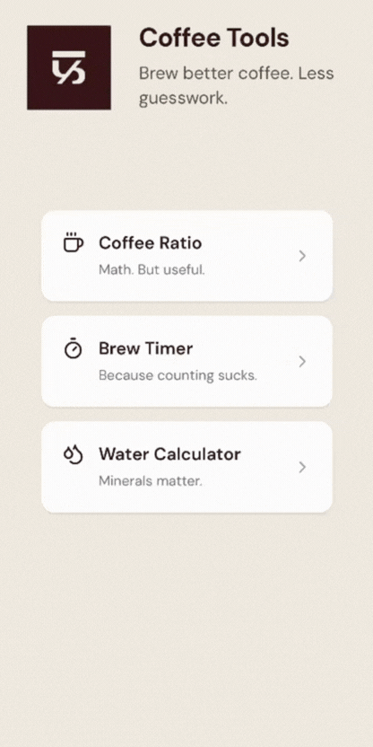
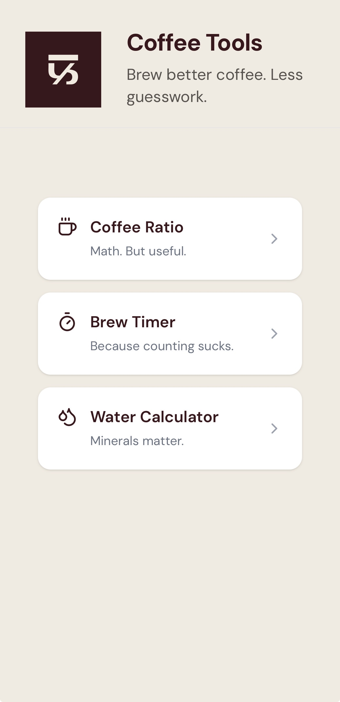
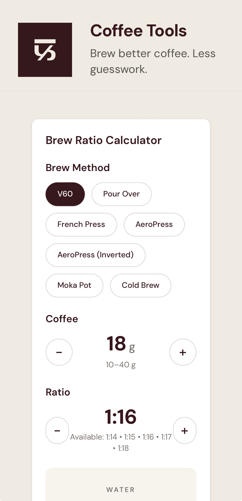
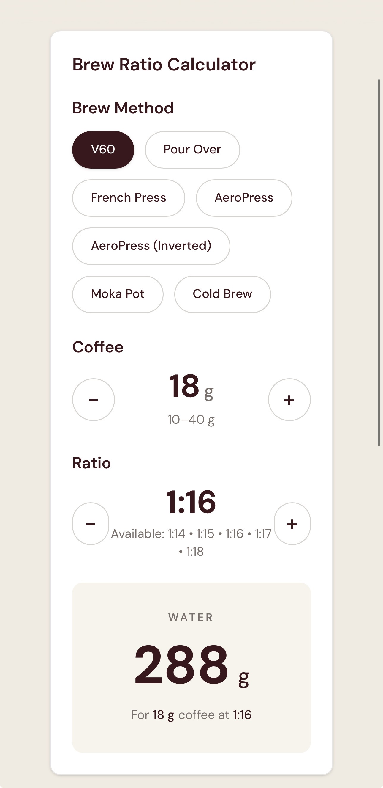
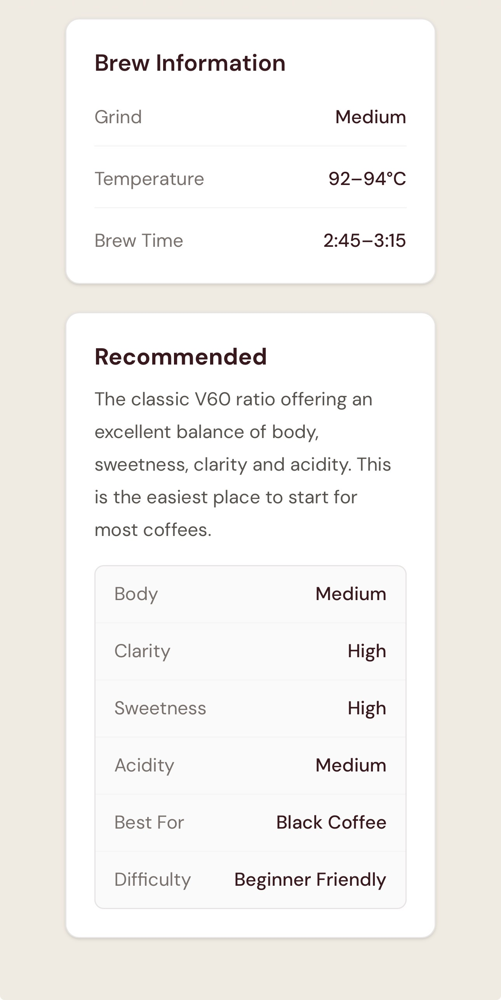
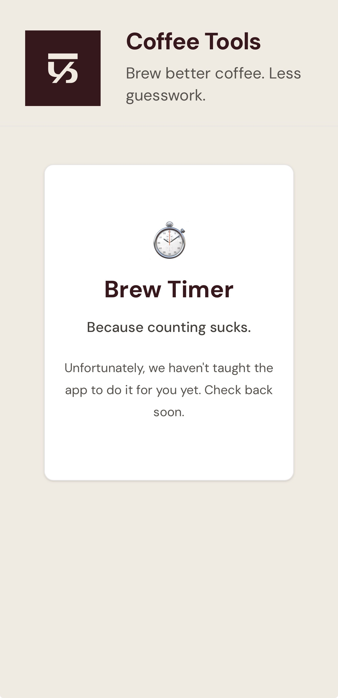
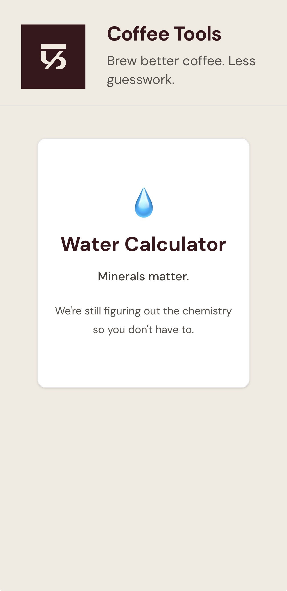

<p align="center">
  
</p>

<h1 align="center">Coffee Tools</h1>

<p align="center">
  <strong>Brew better coffee. Less guesswork.</strong>
</p>

<p align="center">
  An open-source collection of coffee brewing tools by <strong>Flour & Feine</strong>.
</p>

<p align="center">


</p>

---

## Demo

<p align="center">
  
</p>

Coffee Tools is a collection of beautifully simple coffee calculators and brewing utilities designed for home brewers, enthusiasts and professionals.

Whether you're dialing in a V60, experimenting with an AeroPress recipe or simply trying to calculate the correct water amount, Coffee Tools keeps the math out of your brewing.

---

# Features

## Available

- ☕ Brew Ratio Calculator
- 💧 Automatic water calculation
- 📖 Brewing recommendations
- 🌡️ Grind size guidance
- 🌡️ Temperature recommendations
- ⏱️ Brew time recommendations
- 📱 Progressive Web App (PWA)
- 🤖 Native Android application
- ⚡ Fast, lightweight and offline capable

## Coming Soon

- ⏱️ Brew Timer
- 💧 Water Calculator
- 📊 TDS Calculator
- 🎯 Coffee Compass
- 📈 Extraction Yield Calculator
- 📚 Brew Recipe Library
- ❤️ Favourite Recipes

---

# Supported Brew Methods

- V60
- Pour Over
- French Press
- AeroPress
- AeroPress (Inverted)
- Moka Pot
- Cold Brew

More brewing methods will be added in future releases.

---

# Screenshots

## Home

<p align="center">
  
</p>

## Brew Ratio Calculator

<p align="center">
  
  
  
</p>

## Upcoming Tools

<p align="center">
  
  
</p>

---

# Live Demo

### Progressive Web App

https://tools.flourfeine.com

### Android

Available from the GitHub Releases page.

Google Play release coming soon.

---

# Why Coffee Tools?

Coffee brewing shouldn't require spreadsheets.

Coffee Tools helps you calculate brew ratios, water quantities and recommended brewing parameters in seconds so you can focus on making great coffee instead of doing mental math.

---

# Technology

Built with

- React 19
- TypeScript
- Vite
- Capacitor
- Tailwind CSS

Available as

- 🌐 Progressive Web App
- 🤖 Native Android App

---

# Running Locally

Clone the repository.

```bash
git clone https://github.com/ajkilje/coffee-tools.git
cd coffee-tools
```

Install dependencies.

```bash
npm install
```

Run the development server.

```bash
npm run dev
```

---

# Building

## Web

```bash
npm run build
```

## Android APK

```bash
npm run build
npx cap sync android

cd android
.\gradlew assembleRelease
```

APK output

```
android/app/build/outputs/apk/release/app-release.apk
```

## Google Play Bundle (AAB)

```bash
.\gradlew bundleRelease
```

AAB output

```
android/app/build/outputs/bundle/release/app-release.aab
```

---

# Project Structure

```
coffee-tools/
├── android/
├── assets/
├── docs/
│   └── images/
│       ├── demo.gif
│       ├── home.jpeg
│       ├── brew-ratio.jpeg
│       ├── water-result.jpeg
│       ├── brew-information.jpeg
│       ├── brew-timer.jpeg
│       ├── water-calculator.jpeg
│       └── icon.png
├── public/
├── src/
├── package.json
└── README.md
```

---

# Roadmap

## Version 1.1

- Brew Timer
- Water Calculator
- TDS Calculator

## Future

- Coffee Compass
- Extraction Yield Calculator
- Saved Recipes
- Brew Profiles
- Bean Database
- Cloud Sync
- iOS App

---

# Contributing

Contributions are always welcome.

If you'd like to improve Coffee Tools, please open an Issue or submit a Pull Request.

---

# License

This project is licensed under the MIT License.

See the **LICENSE** file for details.

---

# About Flour & Feine

Flour & Feine is an independent specialty coffee roastery based in Thane, India.

Coffee Tools is one of the open-source projects we build for the coffee community.

🌐 https://flourfeine.com

---

<p align="center">
Made with ☕ by <strong>Flour & Feine</strong>
</p>
